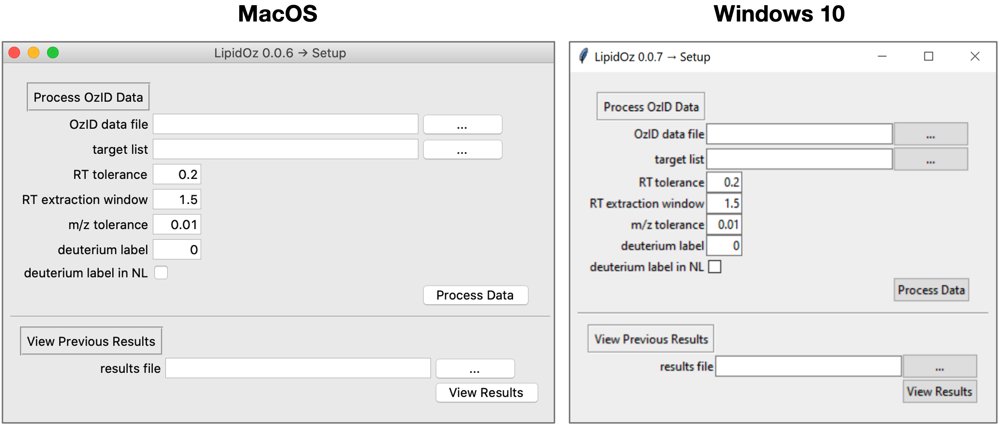
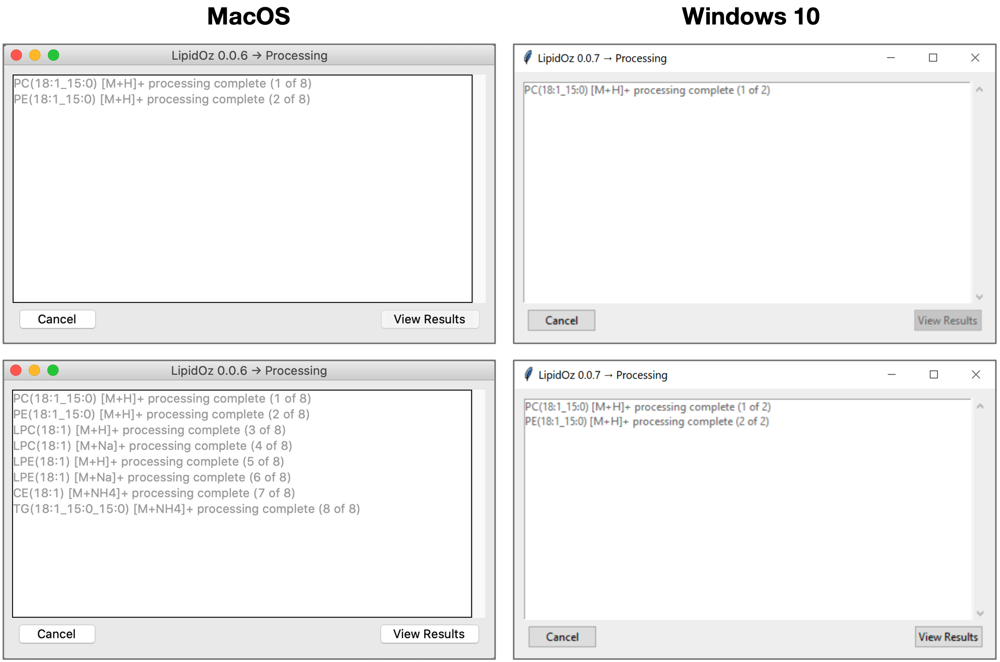
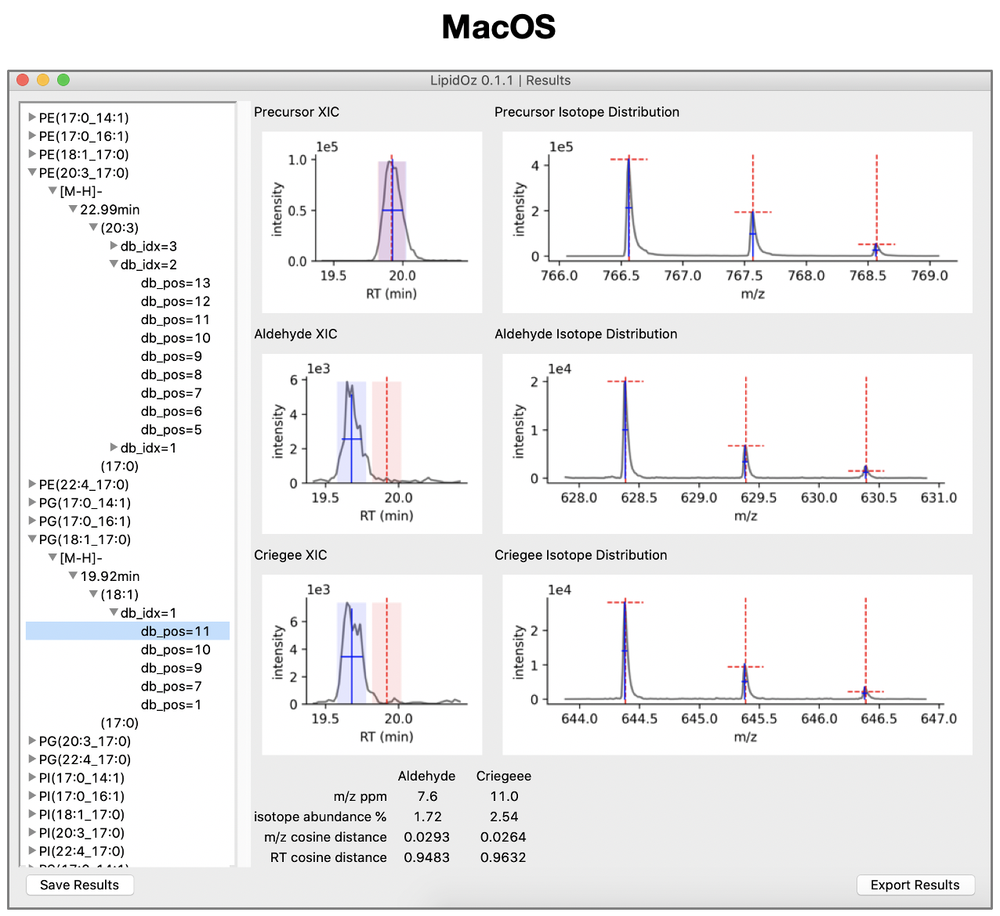
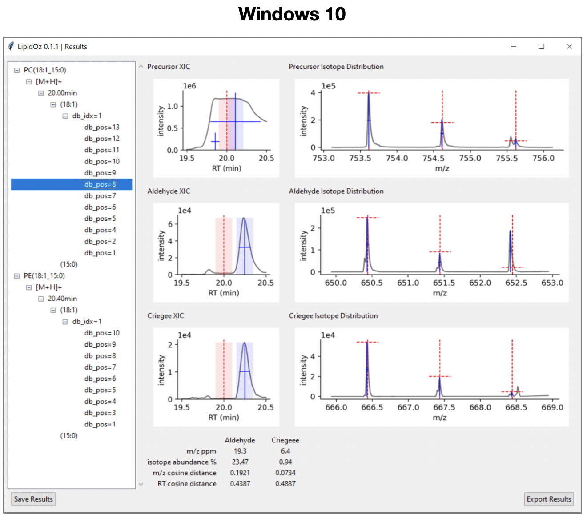

==============================
Graphical User Interface
==============================
The **LipidOz** graphical utility can be installed either as standalone binary executables, or as source code. 

Demonstration Data
------------------------------
GUI Demonstration with example data from Ultimate SPLASH lipid standards available here:
https://zenodo.org/record/7636522

Binary Executables
------------------------------
Binary executables have been built for MacOS and Windows 10: 

* MacOS -- `LipidOz.exe <https://github.com/PNNL-m-q/lipidoz/releases/download/v1.0.0/LipidOz.app.zip>`_
* Windows -- `LipidOz.app <https://github.com/PNNL-m-q/lipidoz/releases/download/v1.0.0/LipidOz.exe>`_

These binary executables (built using `pyinstaller <https://pyinstaller.readthedocs.io/en/stable/index.html>`_) are self-contained and come bundled with all package requirements, including a Python interpreter. 

.. code-block:: 
    :caption: ``pyinstaller`` build commands

    # Windows 10
    pyinstaller --windowed --onefile --clean --noconfirm --icon=lipidoz.ico --add-data='lipidoz.ico;.' LipidOz.py

    # MacOS
    pyinstaller --windowed --onefile --clean --noconfirm --icon=lipidoz.icns LipidOz.py

The powershell script ``build.ps1`` has the above command for building on Windows 10. 

Setup Window
------------------------------
The setup window is used to select OzID data file, lipid target list, and set parameters that control how the data is extracted/processed.

* RT tolerance -- controls the size of the retention time window that is used for extracting MS1 spectra
* RT extraction window -- sets the size of the retention time window used for fitting XIC
* m/z tolerance -- m/z tolerance for XIC extraction
* deuterium label -- number of deuteriums in labeled standards (*e.g*, LipidoMix SPLASH)
* deuterium label in NL -- indicates that the deuteriums in labeled lipids are part of the neutral loss from OzID fragmentation, this happens when the labels are at the end of an unsaturated acyl chain

 There is also the option to load and view results from previously run analyses (skips data processing step). 

Processing Window
------------------------------
The processing window displays the progress as lipid targets are processed, which typically takes 10-30 seconds per lipid target. Once processing is complete, the user is able to proceed to view the results.

Results Window
------------------------------
The results panel is organized into two main panels. The left panel contains a browsable heirarchical menu with all lipid target species and putative double bond positions. The right panel contains plots of XICs and isotope distributions for precursor and putative OzID fragments. Selecting a putative double bond position in the menu populates the right panel with corresponding plots and scoring information. Double clicking on a plot pops out a full resolution image of the plot for closer inspection. Results can either be saved in a binary format for later review (saved in *.lozisoscr* format) or exported as an Excel spreadsheet (*.xlsx*).

The plots section is organized into two columns and three rows. The top row contains plots for the precursor and the lower two rows contain plots for the aldehyde and criegee OzID fragments. The first column contains plots of XICs with fitting results and the second column contains plots of MS1 spectra annotated with theoretical and observed isotope distributions. Plot color scheme:
    
* grey traces -- raw data (XIC and MS1 spectra plots)
* red dashed lines -- target retention time value (XIC plots), theoretical m/z and relative abundance of isotopes in (MS1 spectra plots)
* blue crosses -- represents the position, FWHM, and height of fitted peaks (XIC and MS1 spectra plots)
* light red box -- target retention time +/- retention time tolerance (XIC plots)
* light blue box -- fitted retention time +/- retention time tolerance (XIC plots), used for extraction of MS1 spectra

The scores section contains four scoring components for aldehyde and criegee ions that reflect agreement between putative OzID fragments and precursor signals as well as the agreement of the theoretical and observed isotope distributions for these fragments:

* m/z ppm -- average ppm error between observed and theoretical M, M+1, and M+2 isotopes
* isotope abundance % -- average percentage difference of abundance between observed and theoretical M, M+1, and M+2 isotopes
* m/z cosine distance -- cosine distance between precursor and fragment MS1 spectra (0 = perfect match, 1 = no match)
* RT cosine distance -- cosine distance between precursor and fragment XICs (0 = perfect match, 1 = no match)

