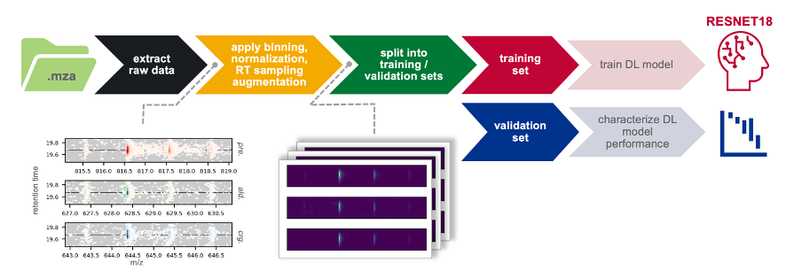

==============================
Machine Learning
==============================
Machine learning model training and inference are accessible through the LipidOz API via functions in the ``lipidoz.workflows`` and ``lipidoz.ml`` subpackages. 

Model Training
------------------------------

Overview
++++++++++++++++++++++++++++++

The process of training a deep learning (DL) model for the assignment of double bond locations for lipids from OzID data is consists of two major steps: 
curation of training data and training/characterizing the model. The dataset for DL model training is constructed using 
function: :func:`lipidoz.workflows.collect_preml_dataset`. Data for DL is extracted for each 
labeled training example as 2D LC-MS profiles (one for the precursor ion and a pair of putative OzID fragments) over the RT +/- 2.5 min range in the 
chromatographic dimension and the M-1.5 to M+2.5 range in the m/z dimension. 
The sparse scan data in the LC-MS profiles is converted into uniformly sampled image data using 2D linear interpolation, normalized to an intensity 
range of 0 to 1, and ~10-fold data augmentation can be performed by resampling the RT dimension of the LC-MS profiles in several ways that simulate 
shifted/narrower/broader chromatographic peaks. Finally, the training examples can be split into separate training and validation sets, 
with splitting performed such that the proportion of True/False training examples is maintained across training and validation sets.

The architecture of the ML model is user-definable, but the published model uses a pre-trained RESNET-18 with the terminal fully-connected 
layers replaced by a 2-node fully-connected layer (one output for True label probability, 
the other for False label probability). Parameters controlling how the model is trained are also user-definable, but for the published model, optimization 
was done using the Adam optimizer and cross entropy loss (weighted according to approximate proportions of True/False training examples in training data) 
was used as the optimization criterion. The model is fed data in batches of training examples (size is user-definable) and model training is continued over 
a user-definable number of epochs. The set of parameters yielding minimal loss can then be saved to file for later use in inference.

Setup
+++++++++++++++++++++++++++++++
Model training requires labeled training examples.
Labeling training examples requires manual verification of double bond positions from results of the normal isotope distribution analysis, and are represented by
pairs of ML target lists. The format of target lists with labeled training examples is the same as for the normal isotope distribution analysis 
(see :ref:`iso-scoring-target-list`), but with additional columns indicating the labeled double bond positions: 

.. code-block:: none
    :caption: Example labeled ML target list 

    lipid,adduct,retention_time,true_dbidx,true_dbpos
    PC(16:0/16:1),[M+H]+,17.325,1,7
    PC(16:0/18:1),[M+H]+,19.337,1,7-9
    PC(16:0/20:4),[M+H]+,17.534,1,6
    PC(16:0/20:4),[M+H]+,17.534,2,9
    PC(16:0/20:4),[M+H]+,17.534,3,12
    PC(16:0/20:4),[M+H]+,17.534,4,15

Each row contains a lipid precursor, MS adduct, retention time, True double bond index, and True double bond position(s) at that 
index (multiple positions at a single index are separated by "-"). Each list also requires a corresponding unlabeled list (omitting the
columns for True double bond index/position) with one row per lipid precursor species:

.. code-block:: none
    :caption: Example unlabeled ML target list 

    lipid,adduct,retention_time
    PC(16:0/16:1),[M+H]+,17.325
    PC(16:0/18:1),[M+H]+,19.337
    PC(16:0/20:4),[M+H]+,17.534

Data Extraction
+++++++++++++++++++++++++++++++
Raw LC-MS profiles for training examples ("pre-ml" data) are extracted from raw data files, using function: :func:`lipidoz.workflows.collect_preml_dataset`. 
The primary inputs to this function are the path to the raw data file, a target list (without labels, see previous section), and other parameters controlling
how the profiles are extracted for the lipid targets in the target list. 

See :ref:`preml-dataset-desc` for reference on the layout of the "pre-ml" data.

.. code-block:: python3
    :caption: Example of extracting LC-MS profiles for training examples 
    :emphasize-lines: 22, 23, 24, 25, 26, 27, 28, 29

    from lipidoz.workflows import collect_preml_dataset

    from config import DATASETS, PRE_ML_PARAMS

    for sample, sample_values in DATASETS.items():
        for ionization, ionization_values in sample_values.items():
            for replicate, replicate_values in ionization_values.items():
                print('========================================')
                print(sample, ionization, replicate)
                for target_set, target_set_values in replicate_values['target_sets'].items():
                    if target_set_values['ml_targets'] is not None:
                        for target_list, target_list_value in target_set_values['ml_targets'].items():
                            print(target_list_value)
                            data_file = replicate_values['data']
                            rt_tol = PRE_ML_PARAMS['rt_window']
                            metadata = target_set_values['metadata']
                            d_label = metadata['d_label']
                            d_label_in_nl = metadata['d_label_in_nl']
                            mza_version = metadata['mza_version']
                            rt_corr_func = eval('lambda x: ' + metadata['rt_corr_func'])
                            t0 = time.time()
                            dset = collect_preml_dataset(data_file, 
                                                        target_list_value, 
                                                        rt_tol=rt_tol,
                                                        d_label=d_label,
                                                        d_label_in_nl=d_label_in_nl,
                                                        mza_version=mza_version,
                                                        ignore_preferred_ionization=True,
                                                        rt_correction_func=rt_corr_func)
                            elapsed = time.time() - t0
                            print('{:.1f} s'.format(elapsed))
                            output_file = '_preml_data/{}_{}_{}_{}_{}.pkl'.format(sample, 
                                                                                ionization, 
                                                                                replicate, 
                                                                                target_set, 
                                                                                target_list)
                            with open(output_file, 'wb') as pf:
                                pickle.dump(dset, pf)
    print('========================================')

The above example shows use of :func:`lipidoz.workflows.collect_preml_dataset` to extract "pre-ml" data from multiple data files and corresponding target lists.
All of the file paths and associated processing parameters are taken from a configuration file, which is the reason for all of the for loops. The highlighted 
lines show how the ``collect_preml_dataset`` function is called, then the return value gets saved in a binary format using ``pickle`` in the last few lines. 

Preparing Data for ML Model Training
++++++++++++++++++++++++++++++++++++++++
The "pre-ml" data consist of sparsely sampled LC-MS profiles for precursors and pairs of putative OzID fragments. To prepare this data for use in ML, 
the profiles need to be converted into uniformly sampled and normalized profiles and grouped together as RGB images, 
using function: :func:`lipidoz.workflows.convert_multi_preml_datasets_labeled`. 

.. code-block:: python3
    :caption: Example of preparing data for ML
    :emphasize-lines: 24, 25, 26, 27, 28, 29

    from lipidoz.workflows import convert_multi_preml_datasets_labeled

    from config import DATASETS, PRE_ML_PARAMS

    augment = PRE_ML_PARAMS['augment']
    for sample, sample_values in DATASETS.items():
        preml_files = []
        ml_target_files = []
        rt_corr_funcs = []
        for ionization, ionization_values in sample_values.items():
            for replicate, replicate_values in ionization_values.items():
                for target_set, target_set_values in replicate_values['target_sets'].items():
                    if target_set_values['ml_targets'] is not None:
                        for target_list, target_list_value in target_set_values['ml_targets'].items():
                                pmf = '_preml_data/{}_{}_{}_{}_{}.pkl'.format(sample, 
                                                                                ionization, 
                                                                                replicate, 
                                                                                target_set, 
                                                                                target_list)
                                preml_files.append(pmf)
                                ml_target_files.append(target_list_value.replace('.csv', '_lbl.csv'))
                                rtcf = eval('lambda x: ' + target_set_values['metadata']['rt_corr_func'])
                                rt_corr_funcs.append(rtcf)
        t_ml_data, f_ml_data = convert_multi_preml_datasets_labeled(preml_files, 
                                                                    ml_target_files, 
                                                                    rt_sampling_augment=augment, 
                                                                    normalize_intensity=True,
                                                                    rt_corr_funcs=rt_corr_funcs, 
                                                                    debug_flag='text')
        t_fname = '_ml_data/{}_T_aug_mldata.npy' if augment else '_ml_data/{}_T_noaug_mldata.npy'
        f_fname = '_ml_data/{}_F_aug_mldata.npy' if augment else '_ml_data/{}_F_noaug_mldata.npy'
        np.save(t_fname.format(sample), true_ml_data)
        np.save(f_fname.format(sample), false_ml_data)

The above example shows use of :func:`lipidoz.workflows.convert_multi_preml_datasets_labeled` to combine and convert "pre-ml" data from multiple data files 
and corresponding labeled target lists.
All of the file paths and associated processing parameters are taken from a configuration file, which is the reason for all of the for loops. The highlighted 
lines show how the ``convert_multi_preml_datasets_labeled`` function is called, then the return values (arrays of training examples constructed as RGB images) 
are saved in a binary format using ``numpy`` in the last few lines.

Training the DL Model
++++++++++++++++++++++++++++++
Model training consists of three main steps:

1. Load the processed ML data from the previous step, initialize dataloaders that will feed data to the model in batches during training
2. Train the model over a specified number of epochs
3. Save the best model parameters so they can be loaded later and used for inference

.. code-block:: python3
    :caption: Example of DL model training

    from lipidoz.ml.data import get_dataloaders_for_ml
    from lipidoz.ml.models.resnet18 import ResNet18

    from config import ML_PARAMS

    # load all of the ML data, combine T/F
    include_sample_sets = ML_PARAMS['include_sample_sets']
    T_data, F_data = [], []
    for sample_set in include_sample_sets:
        for t_data_file in glob('_ml_data/{}_T_aug_*'.format(sample_set)):
            T_data.append(np.load(t_data_file))
        for f_data_file in glob('_ml_data/{}_F_aug_*'.format(sample_set)):
            F_data.append(np.load(f_data_file))
    T_data = np.concatenate(T_data) if len(T_data) > 1 else np.array(T_data[0])
    F_data = np.concatenate(F_data) if len(F_data) > 1 else np.array(F_data[0])

    # get dataloaders for ml
    val_size = ML_PARAMS['val_size']
    batch_size = ML_PARAMS['batch_size']
    shuffle = ML_PARAMS['shuffle']
    random_state = ML_PARAMS['random_state']
    dataloaders, dataset_sizes = get_dataloaders_for_ml(T_data, F_data, 
                                                        val_size=val_size, 
                                                        batch_size=batch_size, 
                                                        shuffle=shuffle, 
                                                        random_state=random_state)
                                                        
    # delete the ML data after dataloaders are initialized to save memory
    del T_data
    del F_data

    # train the model
    model = ResNet18()
    epochs = ML_PARAMS['epochs']    
    model.train(dataloaders, dataset_sizes, epochs=epochs, debug=True)

    # save the model parameters
    model_param_path = '_model_params/resnet18_{}_params.pt'.format('-'.join(ML_PARAMS['include_sample_sets'])) 
    model.save(model_param_path)

Model Inference
------------------------------
There is something else in here. 

Setup
+++++++++++++++++++++++++++++++
Perfoming inference with a trained model requires a target list of lipid targets, without labeled double bond positions.

.. code-block:: none
    :caption: Example unlabeled ML target list 

    lipid,adduct,retention_time
    PC(16:0/16:1),[M+H]+,17.325
    PC(16:0/18:1),[M+H]+,19.337
    PC(16:0/20:4),[M+H]+,17.534

Data Extraction
+++++++++++++++++++++++++++++++
Raw LC-MS profiles ("pre-ml" data) are extracted from raw data files, using function: :func:`lipidoz.workflows.collect_preml_dataset`
in the same fashion as for model training (see above). 
The primary inputs to this function are the path to the raw data file, a target list without labels, and other parameters controlling
how the profiles are extracted for the lipid targets in the target list.

Preparing Data for Inference
+++++++++++++++++++++++++++++++
The "pre-ml" data consist of sparsely sampled LC-MS profiles for precursors and pairs of putative OzID fragments. To prepare this data for use in ML, 
the profiles need to be converted into uniformly sampled and normalized profiles and grouped together as RGB images, 
in a similar fashion as in model training, but using function: :func:`lipidoz.workflows.convert_multi_preml_datasets_unlabeled`.
In contrast to data preparation for model training, no labeled target lists are required and there is no option to perform data augmentation.
Additionally, ``convert_multi_preml_datasets_unlabeled`` only returns one array of processed ML data, rather than two arrays containing 
True and False training examples. 

Performing Inference
+++++++++++++++++++++++++++++++
Performing inference consists of three main steps:

1. Load the processed ML data from the previous step
2. Initialize the model and load optimized parameters 
3. Make predictions

.. code-block:: python3
    :caption: Example

    import pickle

    import numpy as np
    
    from lipidoz.ml.models.resnet18 import ResNet18

    # load the pre-ml data, this has all of the labels for the ML data
    with open('_preml_data/example_preml_data.pkl', 'rb') as pf:
        preml_data = pickle.load(pf)
    labels = [_ for _ in preml_data['targets'].keys()]

    # load the ML data
    X = np.load('_ml_data/example_mldata_noaug.npy')

    # initialize model, load optimized parameters
    model = ResNet18()
    model.load('_model_params/resnet18_params.pt')

    # get predictions
    preds = model.predict(X)

    # get probabilities
    probs = model.predict_proba(X)
